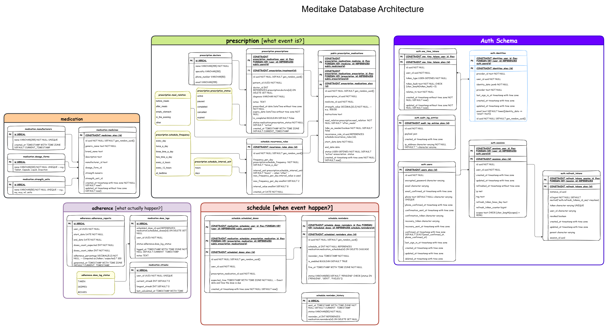

# Meditake Database Schema Documentation

This document provides a comprehensive overview of the Meditake database architecture, which is designed to securely and efficiently manage patient authentication, medication catalogs, prescriptions, dosing schedules, and patient adherence tracking.

The database is structured into five distinct PostgreSQL schemas: `auth`, `medication`, `prescription`, `schedule`, and `adherence`. This separation of concerns ensures maintainability and logical grouping of related data.

---

## 1. Schema Overview

### 1.1 Auth Schema (`auth`)
Manages user identities, authentication, sessions, and security audits.
- **`users`**: Core user accounts (patients, doctors, admins) with credentials and contact verification.
- **`identities`**: Supports OAuth or multi-provider logins linked to users.
- **`sessions` & `refresh_tokens`**: Manages active user sessions and token rotation.
- **`devices`**: Tracks devices used for logging in.
- **`one_time_tokens`**: Handles OTPs for email/phone verification or password resets.
- **`audit_log_entries`**: Immutable log of security events.

### 1.2 Medication Schema (`medication`)
Acts as the master catalog for medicines, ensuring data consistency across prescriptions.
- **`manufacturers`**: Companies producing the medications.
- **`dosage_forms` & `strength_units`**: Standardized units and forms (e.g., Tablet, mg, ml).
- **`medicines`**: The central catalog combining generic/brand names, strengths, and forms.

### 1.3 Prescription Schema (`prescription`)
Handles the relationship between doctors, patients, and the medications prescribed.
- **`doctors`**: Information about prescribers.
- **`prescriptions`**: The overarching prescription record linking a patient, doctor, and diagnosis.
- **`prescription_medications`**: Specific medicines within a prescription, including instructions and meal relations.
- **`recurrence_rules`**: Defines how often a medication should be taken (e.g., twice a day, every 8 hours).

### 1.4 Schedule Schema (`schedule`)
Translates recurrence rules into actionable, time-bound events.
- **`medication_schedules`**: The active schedules mapped from prescription medications.
- **`scheduled_doses`**: The actual instances (time slots) when a patient is supposed to take a dose.

### 1.5 Adherence Schema (`adherence`)
Tracks patient compliance and generates gamified/analytical metrics.
- **`dose_logs`**: Records the actual outcome of a scheduled dose (taken, skipped, missed).
- **`adherence_reports`**: Aggregated statistics over a specific date range.
- **`streaks`**: Gamification metrics tracking consecutive days of perfect adherence.

---

## 2. Row Level Security (RLS) & Data Privacy

Patient data privacy is a critical requirement in healthcare domains (e.g., HIPAA compliance). This schema implements **PostgreSQL Row Level Security (RLS)** across almost all tables.
- RLS ensures that database queries automatically filter rows so that a user can only `SELECT`, `UPDATE`, or `DELETE` their own data.
- The application sets a session variable `app.current_user_id`, which the database uses in RLS policies to evaluate access permissions dynamically.

---

## 3. Domain Questions Addressed by the Schema

### Q1: How does the system handle complex, varying medication schedules (e.g., "take as needed" vs. "twice daily")?
**Answer:** The `prescription.recurrence_rules` table abstracts the scheduling logic. It supports different frequencies (`frequency_per_day`), intervals (`interval_unit` in hours or days), and limits (`max_frequency_per_day`). Additionally, a `take_as_needed` boolean flag in `prescription_medications` easily differentiates between strict schedules and PRN (pro re nata) medications.

### Q2: How is timezone handled if a patient travels?
**Answer:** Timezones are explicitly stored in the `prescription.recurrence_rules` table (`timezone` column). Dates and times across the system use `timestamptz` (timestamp with time zone) to ensure absolute points in time are preserved. When calculating upcoming `scheduled_doses`, the system can use the stored timezone to generate the correct local times for the patient.

### Q3: What happens if a patient skips a dose on their doctor's advice? Does it ruin their adherence streak?
**Answer:** The system differentiates between dose outcomes using the `adherence.dose_logs_status` enum (`taken`, `skipped`, `missed`). A `skipped` status can be programmed in the application logic to temporarily pause or ignore the adherence penalty, ensuring the user's `streaks` are not unfairly broken due to medical advice.

### Q4: Can a single prescription contain multiple medications?
**Answer:** Yes. The `prescription.prescriptions` table represents the encounter or the overarching document, while `prescription.prescription_medications` allows a one-to-many relationship. A patient can have one prescription from a visit that includes three different medicines, each with its own specific recurrence rules and start/end dates.

### Q5: How does the system prevent patients from viewing each other's medical data?
**Answer:** Data isolation is enforced at the database layer using Row Level Security. Policies like `prescriptions_patient_read` and `sched_doses_patient_read` ensure that queries naturally return zero rows if User A attempts to query the prescription or schedule IDs belonging to User B. 

### Q6: How are changes to the medication catalog managed without breaking historical prescriptions?
**Answer:** The `medication.medicines` catalog uses an `is_active` flag. If a medication is discontinued or removed from the catalog, it is marked as inactive rather than deleted. This ensures that historical `prescription_medications` still successfully reference the correct `medicine_id` for compliance and record-keeping.
