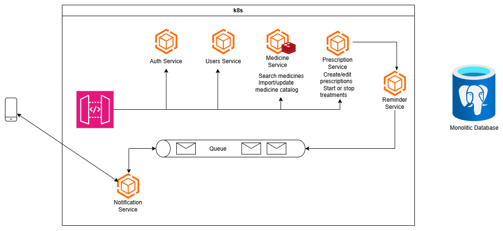

# MediTake Backend Architecture

## Overview

MediTake is a medication reminder and treatment support platform built for people who manage long-term or chronic medication routines.

The backend is designed as a microservice-based system so that authentication, user data, medicine catalog management, prescription handling, scheduling, and notifications can evolve independently.

The diagram in this folder shows the current development direction:

## Design Goals

- Keep the system easy to understand for new contributors.
- Separate business concerns into services that can grow independently.
- Support medication reminders, prescription updates, and notification delivery.
- Keep the current prototype practical while leaving room for future scaling.

## High-Level Flow

1. A mobile or web client sends requests to the API gateway.
2. The gateway handles authentication, rate limiting, request aggregation, and logging.
3. The gateway forwards requests to the relevant backend service.
4. Core services store and read data from the shared prototype database.
5. The reminder flow runs during non-peak hours and prepares notifications for the next day.
6. The queue decouples reminder generation from notification delivery.
7. The notification service sends user-facing messages through the supported channels.

## Service Breakdown

### API Gateway

The API gateway is the entry point for client requests.

It is responsible for:

- routing requests to the correct service
- enforcing authentication checks
- applying rate limits
- aggregating data from multiple services when needed
- logging requests for traceability

### Auth Service

The auth service handles user authentication.

Current and planned direction:

- JWT is the primary authentication method
- OAuth is planned for future expansion
- public and private key support with Ed25519 signing and verification is planned for stronger cryptographic identity handling

### Users Service

The users service currently focuses on individual users who manage long-term medication for chronic conditions.

At this stage, it is centered on:

- core user identity
- basic user profile data
- the foundation for later role-based features

Future versions can add:

- roles
- account preferences
- richer profile data
- other user management features

### Medicine Service

The medicine service manages the medicine catalog and search experience.

Current direction:

- the pre existing data will be inserted into the medicine table during the prototype phase
- Redis-style caching is shown in the diagram to support faster medicine lookups

Planned future work:

- a dedicated platform for CRUD operations on the medicine catalog
- moderation and observation workflows for catalog quality

### Prescription Service

The prescription service manages treatment records.

Its responsibilities include:

- creating prescriptions
- editing prescriptions
- starting treatments
- stopping treatments
- storing scheduling-related data such as `schedule_mediations`

### Reminder Service

The reminder service is responsible for preparing reminders based on medication schedules.

Planned behavior:

- run during non-peak hours, such as around 12 AM or 1 AM
- use gRPC to trigger the scheduling algorithm for the current day
- read from `schedule_mediations`
- identify active medication for the next day
- prepare reminder jobs for downstream delivery

This keeps reminder computation away from the user-facing request path.

### Queue

The queue acts as a buffer between reminder generation and notification delivery.

Its job is to:

- decouple scheduling from message sending
- smooth out spikes in notification traffic
- help the system stay responsive even when many reminders are created at once

### Notification Service

The notification service consumes queued reminder jobs and sends user-facing notifications.

Current channels:

- in-app notifications
- email notifications

Current implementation uses Firebase Messaging for the active notification flow, with additional delivery methods planned later.

### Shared Prototype Database

The current architecture uses a monolithic database for prototype purposes.

This is intentional for the development phase because it keeps the system easier to iterate on while the product and data model are still evolving.

## Current Constraints

- the database is shared instead of split by service
- medicine ingestion is still based on open-source data collection
- reminder scheduling is still being formalized
- notification support is intentionally limited for now

## Future Plans

The architecture is expected to evolve in these directions:

- split the monolithic database into service-oriented storage
- refine the scheduling algorithm for reminders
- add richer role and account management
- complete the OAuth path and key-based auth design
- expand notification channels beyond the current setup
- add stronger observability and operational tooling
- build a dedicated medicine management platform for CRUD and review workflows

## Summary

MediTake is being shaped as a practical, modular backend for medication adherence.

The current design favors clarity and speed of development, while the planned future work focuses on stronger separation, better security, and more scalable operations.
